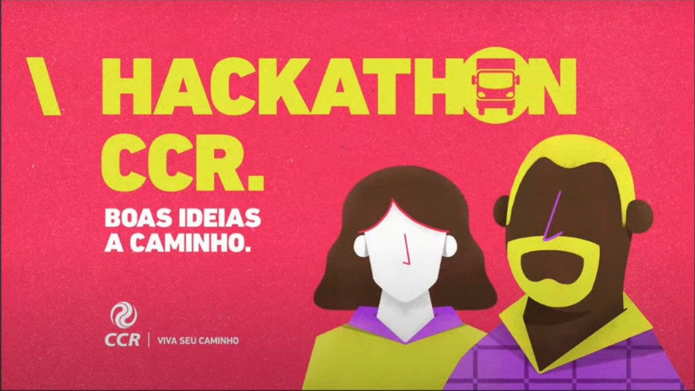

<p align="center">
  <a  href="">
    
  </a>
</p>
  <h1 align="center">Projeto para o HackathonCCR</h1>


  <p align="center">
  <a href="https://github.com/hpbonfim/HackathonCCR#readme">
    
  </a>

  <a href="https://github.com/hpbonfim/HackathonCCR#readme">
    
  </a>

  <a href="https://github.com/hpbonfim/HackathonCCR#readme">
    
  </a>

  <a href="https://github.com/hpbonfim/HackathonCCR/commits/master">
    
  </a>

  <a href="https://github.com/hpbonfim/HackathonCCR#readme">
    
  </a>

  <a href="https://github.com/hpbonfim/HackathonCCR/graphs/commit-activity">
    
  </a>
  </p>


<p align="center">
  <a  href="">
    
  </a>
</p>


|Tecnologias utilizadas  |
|---------|
|[TypeScript](https://www.typescriptlang.org/)     |
|[React Native](https://reactnative.dev/)   |
|[Node v12.17.0](https://nodejs.org/en/)     |
|[npm  6.14.4](https://www.npmjs.com/)    |


### Iniciar o Mobile

``` 
$ npm install
$ expo start
```


<p align="center">Made with ❤️ by <a href="https://github.com/hpbonfim" >Henrique Bonfim</a>
